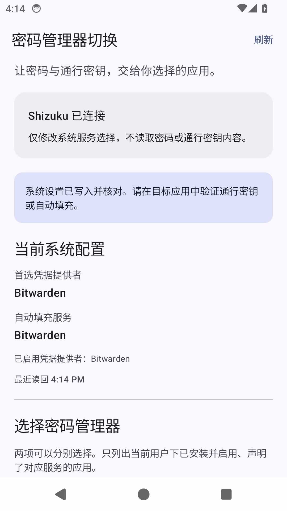
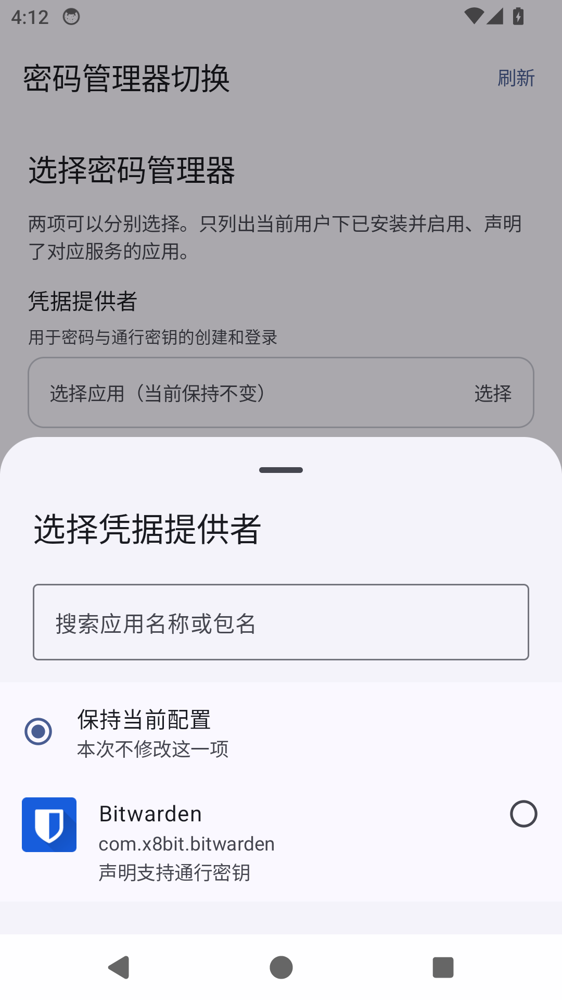

# 密码管理器切换

一个通过 Shizuku 查看、切换默认密码管理器的原生 Android 工具。针对 HyperOS 中第三方密码管理器设置入口不可用的情况，无需 root，无需手动输入包名。

[下载最新版](https://github.com/cr-zhichen/password-manager-switch/releases/latest) · [MIT 许可证](LICENSE)

 

## 能做什么

- 动态查找当前 Android 用户安装并启用的凭据服务和自动填充服务，显示应用名称、图标、包名及声明能力；同一应用的多个服务可以分别选择。
- 分别选择凭据提供者与自动填充，也可以在一次操作中同时设置两项。
- 读取 `credential_service`、`credential_service_primary`、`autofill_service`，显示当前配置。
- 选择凭据提供者时默认将启用列表替换为所选服务，匹配用户提供的 ADB 方案；也可主动选择保留其他已启用提供者。不会停用或卸载应用。
- 写入前确认、保存本机备份并检查配置是否被其他进程改动；写入后核对全部三项。部分失败时尽力回滚并报告读回结果。
- 恢复上次配置，正确处理原本未设置的键。备份只保存服务组件名，没有密码内容。
- 原生 Material 3、动态配色、明暗主题、搜索与技术详情。
- 启动时自动检查 GitHub Release（最多每 6 小时一次），支持手动检查；发现新版本后点击下载 APK 并由系统确认安装，行为与背屏工具一致。

## 使用

1. 手机需 Android 14 或以上。安装支持 Credential Manager 的密码管理器，打开并完成它的初始化和账号登录。
2. 安装并启动 [Shizuku](https://shizuku.rikka.app/download/)。非 root 设备可用无线调试启动；手机重启后通常需要重新启动 Shizuku。
3. 安装本应用，打开后授予 Shizuku 权限。
4. 在「凭据提供者」中选择应用；需要修改表单填充时，再在「自动填充服务」中选择应用。
5. 点击「应用更改」，检查确认页并应用。系统读回一致后，去目标应用测试添加/使用通行密钥和自动填充。
6. 需要撤销时点击「恢复上次配置」。恢复前可查看原配置；已卸载或停用的服务不会因恢复配置而重新可用。

选择界面中的「保持当前配置」表示本次不修改该项，不是关闭该服务。

## 边界

- 这两个体系是不同的服务。原帖两条 `credential_service*` 命令不会顺带设置 `autofill_service`。
- 设置读回成功只证明系统配置与选择一致，不能保证厂商固件、目标应用或密码管理器实际的通行密钥创建流程无缺陷。
- 某些系统内置提供者、设备策略、工作资料限制和系统更新可能影响行为。应用只处理安装本应用的 Android 用户，不跨用户操作。
- 一般应用不能被随意设成密码管理器；只有声明对应服务、绑定权限且已启用的应用才能出现在列表中。不需要 `QUERY_ALL_PACKAGES`。
- 应用仅为检查 GitHub Release 更新申请联网权限，不上传配置或凭据，也不申请存储空间、无障碍或设备管理权限。Shizuku 操作被限制在三个设置键的读写。
- 系统三项设置不是原子事务。应用会串行写入、检测错误并尽力恢复；进程被系统直接终止时不能保证即时回滚，可重新打开并用本地备份恢复。
- GitHub Release 提供独立正式签名 APK 与 SHA-256 校验文件。调试 APK 使用不同签名，不能直接覆盖正式版；日常使用请安装 Release 版本。

## 开发

工具版本和任务均在 `mise.toml` 中，沿用本机已安装的 Java 17、Gradle 8.13 和 Android SDK 工具链。`compileSdk/targetSdk` 为 36，`minSdk` 为 34。

```sh
mise trust
mise install
# 首次使用 Android SDK 需先通过 sdkmanager --licenses 接受许可证
mise run sdk
mise run package
mise run export
```

交付 APK 位于 `dist/password-manager-switch.apk`。`mise run package` 包含 Android Lint、核心设置事务测试和 APK 构建；没有 UI 单元测试。

```sh
mise run devices
ANDROID_SERIAL=<设备序列号> mise run install
```

连接物理设备后的人工验收：授权前后、权限拒绝、Shizuku 停止/重启、多种密码管理器的发现、独立/联合设置、保留其他提供者、恢复空配置、回到前台刷新、通行密钥创建/登录、自动填充、深色和大字体。

已执行的构建与普通 Android 模拟器验收见 [验证记录](docs/VALIDATION.md)。HyperOS 真机通行密钥业务效果仍需验证。

## CI、签名与发布

- `main` 推送、PR 和手动触发 CI：Android Lint、设置事务/更新策略测试、工作流/脚本静态检查、调试 APK 构建。
- 推送 `v*` 标签触发 Release：验证标签、运行检查、正式签名、核对包名/版本/证书，发布 APK 和 SHA-256。预发布标签会标记为 prerelease，正式版更新不会跳到预发布版。
- `versionName` 来自标签，`versionCode` 为 `1000 + GitHub Release workflow run_number`，随发布工作流递增。不要删除重建 Release 工作流导致计数回退。
- `signing/release.p12` 是 AES-256 加密的 PKCS#12，按背屏项目方式入库；`signing/certificate-sha256.txt` 是公开证书指纹。
- 独立的 48 字节随机密码保存在本地 `.signing/release-password`（不入库），同时配置在 GitHub `release` Environment 的 `ANDROID_KEYSTORE_PASSWORD` Secret。证书和密码需分别备份；后续版本继续使用同一发布证书。

首次生成（已有文件时拒绝覆盖）：

```sh
mise run signing:generate-release
gh secret set ANDROID_KEYSTORE_PASSWORD --env release < .signing/release-password
```

本地正式构建：

```sh
export RELEASE_TAG=v1.0.0 BUILD_NUMBER=1
export ANDROID_KEYSTORE_PASSWORD="$(cat .signing/release-password)"
mise run release
unset ANDROID_KEYSTORE_PASSWORD
```

后续发布：提交代码后创建新版本标签并推送。CI 发布成功后，应用会从固定项目地址发现更新。

```sh
git tag v1.0.1
git push origin main v1.0.1
```

## 实现依据

- [Android Credential Provider 集成说明](https://developer.android.com/identity/sign-in/credential-provider)：服务发现 action、绑定权限、凭据能力元数据。
- [AOSP Settings](https://github.com/aosp-mirror/platform_frameworks_base/blob/master/core/java/android/provider/Settings.java)：三个 secure settings 键。
- [AOSP CredentialManagerService](https://github.com/aosp-mirror/platform_frameworks_base/blob/master/services/credentials/java/com/android/server/credentials/CredentialManagerService.java)：启用/首选列表的冒号分隔格式。
- [Shizuku API 与 UserService 文档](https://github.com/RikkaApps/Shizuku-API)：授权、Binder 生命周期和 shell 身份进程。

Shizuku 依赖使用 MIT 许可；AndroidX 依赖使用 Apache 2.0 许可。
